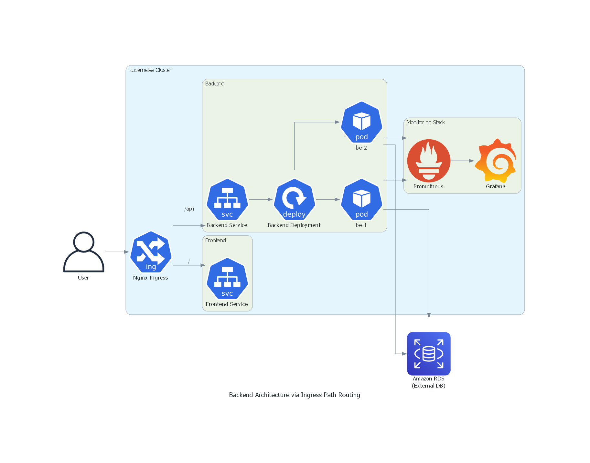
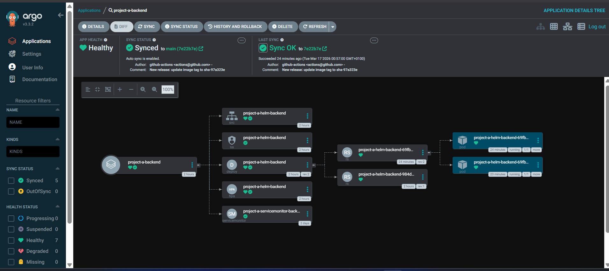
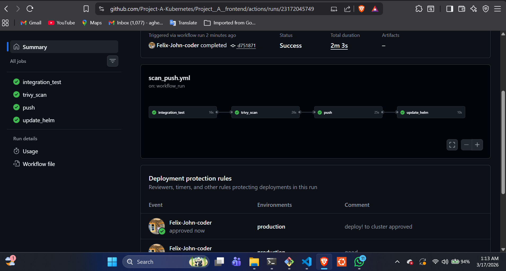
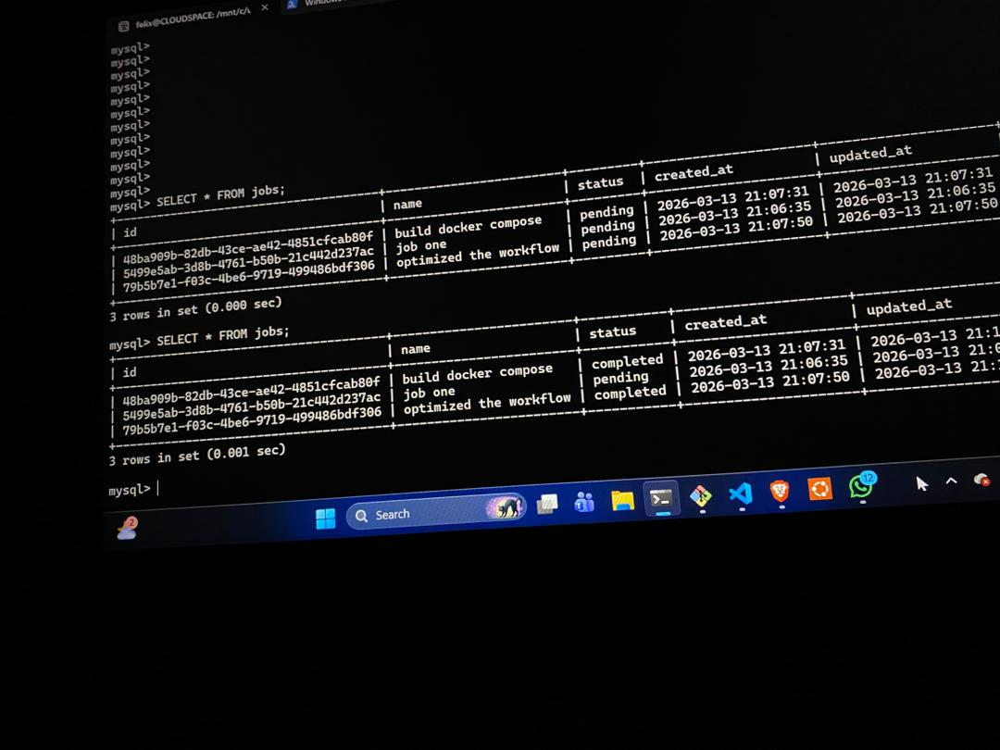
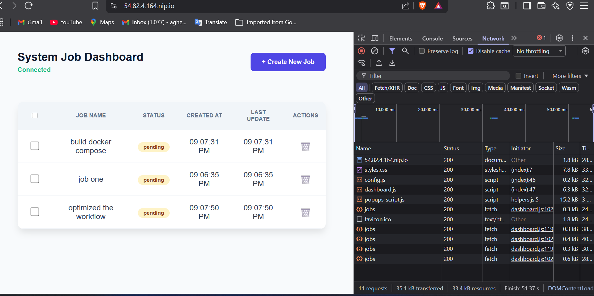
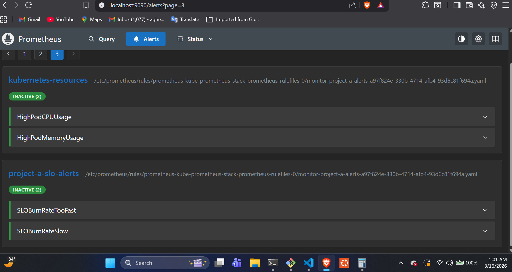

# Backend Helm Chart

## Overview

This repository contains a **production-grade Helm chart** for deploying the backend component of Project A on Kubernetes. The chart is designed with **scalability, security, observability, and GitOps practices** in mind.

It supports full lifecycle management of the backend application, including deployment, networking, TLS, autoscaling, monitoring, and continuous delivery via ArgoCD just like my frontend.

---

## Key Features

* Kubernetes-native deployment (Deployment, Service, hpa)
* Horizontal Pod Autoscaling (HPA)
* serviceAccount(Role) for short live access to AWS
* Prometheus monitoring via ServiceMonitor
* GitOps-ready with ArgoCD Application
* Secrets configured with external secret operator
* Connected to database(AWS RDS)
* Production-grade security and resource management

---

## Architecture Components

* Deployment
* Service
* HPA
* ServiceMonitor
* serviceAccount
* Database Created with Terraform 
* ArgoCD Application

---
## Architecture Diagram
### System Diagram


---
### Diagram of Argocd watching and syncing cluster


---

## Repository Structure

```
backend-helm-chart/
├── Chart.yaml
├── values.yaml
├── templates/
│   ├── deployment.yaml
│   ├── service.yaml
│   ├── hpa.yaml
│   ├── servicemonitor.yaml
│   ├── argocd-application.yaml
│   └── _helpers.tpl
```

---

## Environment Configuration (Production vs Staging)

### Example: `values-prod.yaml`

```yaml
replicaCount: 3
image:
  repository: <ECR_REPO>
  tag: sha-66025d3

resources:
  requests:
    cpu: "250m"
    memory: "256Mi"
  limits:
    cpu: "500m"
    memory: "512Mi"

autoscaling:
  enabled: true
  minReplicas: 3
  maxReplicas: 10

ingress:
  enabled: true
  hosts:
    - app.example.com

tls:
  enabled: true
```

### Example: `values-staging.yaml`

```yaml
replicaCount: 1
image:
  repository: <ECR_REPO>
  tag: latest

autoscaling:
  enabled: false

ingress:
  hosts:
    - staging.example.com
```

---

## ArgoCD GitOps (Multi-Environment)

### ApplicationSet Example

```yaml
apiVersion: argoproj.io/v1alpha1
kind: ApplicationSet
metadata:
  name: backend-appset
spec:
  generators:
    - list:
        elements:
          - env: prod
            namespace: prod
          - env: staging
            namespace: staging
  template:
    metadata:
      name: backend-{{env}}
    spec:
      project: default
      source:
        repoURL: <REPO_URL>
        targetRevision: main
        path: .
        helm:
          valueFiles:
            - values-{{env}}.yaml
      destination:
        server: https://kubernetes.default.svc
        namespace: '{{namespace}}'
      syncPolicy:
        automated:
          prune: true
          selfHeal: true
```

---
## Auto updated Helm Chart diagram
* With CICD we update the helm repo after images has been built and push to ecr automatically


## AWS ECR + IRSA Integration

### Image Pull Secret

```bash
#For local minikube test
kubectl create secret docker-registry ecr-secret \
  --docker-server=<AWS_ACCOUNT_ID>.dkr.ecr.<REGION>.amazonaws.com \
  --docker-username=AWS \
  --docker-password=$(aws ecr get-login-password --region <REGION>) \
  -n prod
```

### IRSA (IAM Role for Service Account)

* Associated IAM role(created with terraform) with Kubernetes ServiceAccount
* Grant least-privilege access (ECR pullOnly)

---
## Database 
### database configuration

- The database was automated and created with terraform .
- database is connected to the cluster 
- still working on this now ...
---
## Ingress Security Hardening
**Route Traffic from ingress at PATH /api to my backend service**
Recommended annotations:

```yaml
nginx.ingress.kubernetes.io/backend-protocol: "HTTP" #internalrouting is HTTP
nginx.ingress.kubernetes.io/force-ssl-redirect: "true" #forcing ssl request 
nginx.ingress.kubernetes.io/proxy-body-size: "10m"
cert-manager.io/cluster-issuer: letsencrypt-production
nginx.ingress.kubernetes.io/proxy-connect-timeout: "60"
nginx.ingress.kubernetes.io/proxy-read-timeout: "60"
nginx.ingress.kubernetes.io/proxy-send-timeout: "60"
nginx.ingress.kubernetes.io/limit-rps: "5" #change to desire

```
---
### Diagram of my backend connected to my database


---
### Diagram of my frontend connected to my backend and database


---
## Observability & Alerting
-   monitoring: we collect Prometheus metrics for container health, CPU, memory, and request  rates
-   Alerts configured for errors rate, success rate, or failed deployments (SLI, SLO, Error Budget, Burn rate)

---

### Prometheus Alert Example

```yaml
groups:
  - name: backend-alerts
    rules:
      - alert: HighCPUUsage
        expr: rate(container_cpu_usage_seconds_total[5m]) > 0.7
        for: 2m
        labels:
          severity: warning
        annotations:
          summary: High CPU usage detected
```

### Metrics

* `/metrics` endpoint exposed
* Scraped via ServiceMonitor
* Visualized in Grafana dashboards

---
### Picture of prometheus rule configured and backend service discovey


- This prometheus rule send alert to slack channel when pod is crashing or
- when pod CPU and memory Usage exceed limits defined in the **resources:**
- It Collects metrics and send ALERT when our SLO is **violated** to slack teams or pagerduty if configured
---

### Picture of  Alert firing during Violated SLI,SLO,burn rate 


---
### Picture of Alert when issue was resolved and Alert stop firing 


---
> **Note:** Check [`project-a-observability` ](https://github.com/Project-A-Kubernetes/Project_A_Observability.git) for the observability Helm chart that is automated with Argocd.
---
> **Important** Check [`project-a-cluster-stacks-tools` ](https://github.com/Project-A-Kubernetes/Project_A_Observability.git) for the monitoring stacks, networking and security Helm chart automated with Argocd.

---
## Deployment Commands

```bash
helm install backend ./-Project_A_helm_chart_backend -n prod
helm upgrade backend ./-Project_A_helm_chart_backend -n prod
helm uninstall backend -n prod

```
---
### Use Argocd
```
argocd app create -f <Application_Name>
```

---

## Release Strategy

* Follow **SHA- commit versioning and latest label**
* Separate:

  * Chart version (`Chart.yaml`)
  * App version (`appVersion`)

---

## Scalability & Reliability

* HPA-based scaling
* Pod health Probing
* Rolling updates (zero downtime)
* Stateless design

---

## Cost Optimization

* Autoscaling reduces idle cost
* Scales up or down due to cpu and memory usage
* Right-sized resource requests/limits
* Compatible with Cluster Autoscaler

---

## Extensibility

Future improvements:

* Service mesh (Istio / Linkerd)
* Cluster Autoscaler 
* Blue and Green Release
* Network Policy

---

## Security Best Practices

* Enforced HTTPS at ingress level 
* No secrets in ConfigMaps or Chart
* Pod was giving least permission in the cluster using **securitContext** in Deployment
* Least privilege IAM (IRSA)
* Use Github App for short live access to repository with least permission
* Resource limits to prevent abuse

---

## Summary

This Helm chart delivers a **production-ready backend platform** with:

* Secure ingress and TLS
* Autoscaling
* Observability
* Reliability
* GitOps-driven deployments

Designed to reflect **real-world DevOps engineering standards** used in production environments.

## Project-A